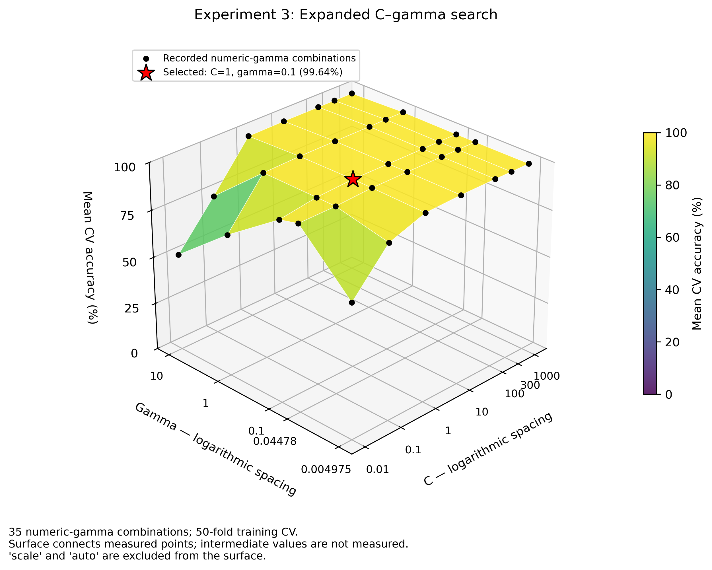
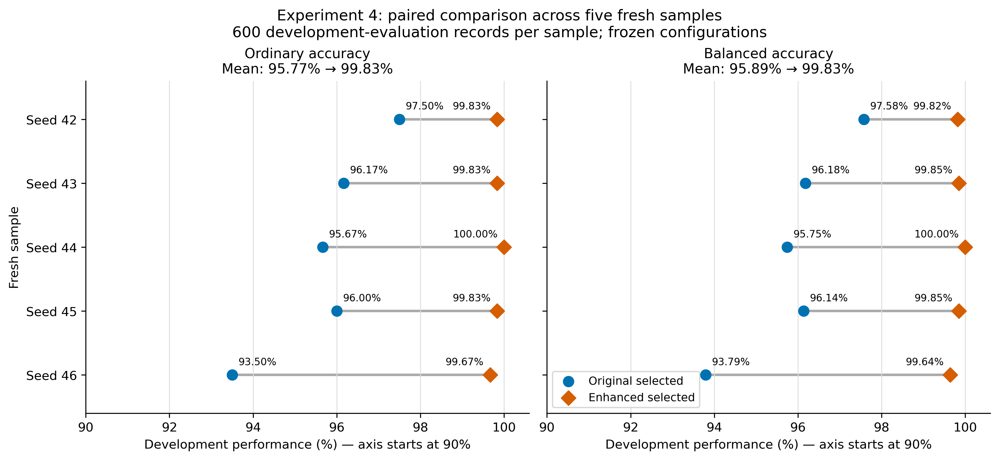
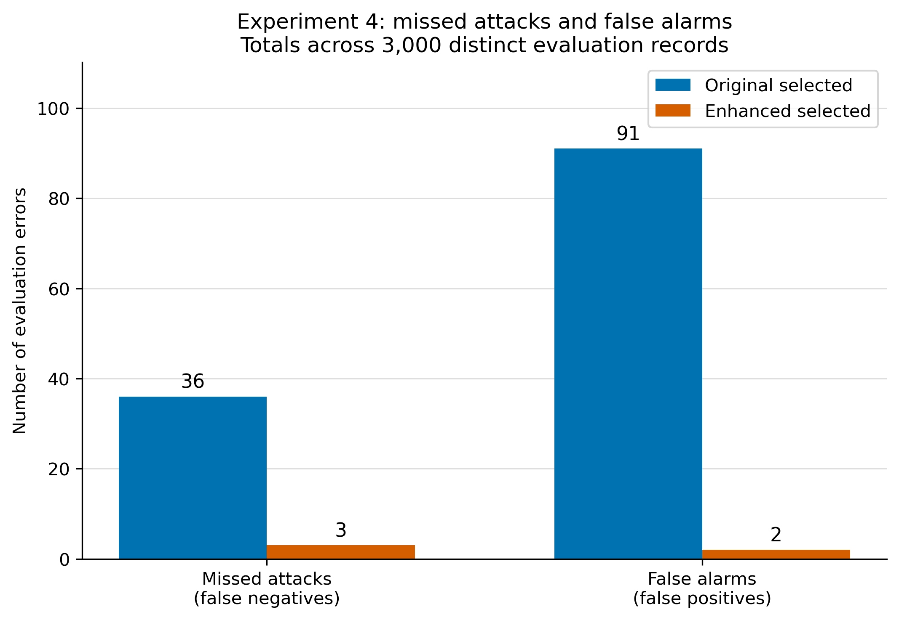

# SVM Network Intrusion Detection: Controlled Enhancements

Code supplement for an AI Methods / JATI study of an RBF-kernel support vector
machine for benign versus LOIC-HTTP DDoS classification using one CSE-CIC-IDS2018 CSV.

## Notebooks

- [Experiments 1–3](notebooks/SVM_Enhancement_Controlled_Experiments.ipynb):
  source-equivalent unscaled baseline, scaling with the original grid, and expanded C–gamma search.
- [Experiment 4](notebooks/SVM_Experiment_4_Repeated_Sample_Validation.ipynb):
  five fresh-sample comparisons of two previously selected, frozen configurations.

The earlier pre-tuning version is omitted to avoid duplicating the working notebook.
The original author's notebook is linked below, rather than republished as our work.

## From the original source to this implementation

The original GitHub notebook provided the starting workflow: prepare network-flow
features, draw a 2,000-row sample, make a 70/30 split and use `GridSearchCV` to
select an RBF SVM by ordinary accuracy. Its search already tested different C and
gamma values. Our study evaluates changes to that workflow, rather than introducing
SVM or grid search as new methods.

**C** controls the penalty for training errors. **Gamma** controls how locally the
RBF kernel responds to a training observation. The original setting
`gamma='scale'` chooses gamma from the input variance; it **does not standardize
the features**. A search's “best parameters” are best under its tested candidates,
input representation, folds and selection metric, rather than a proven global optimum.

1. **Reconstruct and measure the original workflow — Experiment 1 / A.**
   Keep the source's sampling order, seed 42, 77-feature policy, unscaled SVM and
   original grid: `C=[0.1, 1, 10, 100]` and
   `gamma=['scale', 'auto', 0.1, 1, 10]`. That gives 20 candidates and 1,000 CV fits.
   Record balanced accuracy, attack precision/recall/F1, confusion-matrix counts,
   training and CV scores, predictions and overlap checks alongside ordinary
   accuracy. These measurements describe the existing model without changing
   which score selects it. Read the CSV in chunks and limit CV to two workers
   for practical resource use. This is a source-equivalent reconstruction with
   instrumentation, rather than an untouched execution of the original notebook.

2. **Add scaling and reselect parameters — Experiment 2 / B.**
   Put `StandardScaler` before `SVC` inside a scikit-learn pipeline. The scaler
   learns its mean and variance from each CV training fold, then from the full
   training partition for the selected model. Development rows do not fit it.
   Keep the same sample, split, folds, 20 candidates and ordinary-accuracy
   selection rule. The selected settings change from `C=100, gamma='scale'` to
   `C=1, gamma=0.1`. This comparison measures **scaling with parameter reselection**;
   it does not isolate scaling at fixed C and gamma.

3. **Expand the scaled search — Experiment 3 / C.**
   Retain every original candidate and extend C to
   `[0.01, 0.1, 1, 10, 100, 300, 1000]`. Add two numeric gamma values at one third
   and three times a reference calculated from standardized training data only
   (approximately `0.004975` and `0.044776` in the recorded run). The full search
   now has 49 combinations and 2,450 CV fits. Keep the sample, pipeline, folds
   and selection rule fixed. It selects the same configuration as Experiment 2
   and makes identical development predictions: **the larger search adds no gain**.

4. **Check the selected configurations on fresh samples — Experiment 4.**
   Freeze the unscaled `C=100, gamma='scale'` and scaled `C=1, gamma=0.1` models.
   Compare them on five disjoint 2,000-row samples, using the same 1,400 training
   and 600 development rows for both models within each sample. Exclude tracked
   historical and reserved Flow IDs, and group related rows by Flow ID or exact
   feature identity. Use 50 shuffled grouped CV folds and check every outer and
   CV boundary. There is no new parameter search or selection of favorable seeds.
   This strengthens the comparison within the sampled traffic, while changing
   the grouping protocol from the earlier row-random evaluation.

The opportunity was therefore to test scaling together with parameter selection
and to check the resulting advantage across fresh samples. The results do not
show that the original grid-search choice was wrong for its original setup, or
that widening a grid necessarily improves a classifier.

## Recorded development findings

The figures below come from the completed experiments. **All reported evaluation
results are development-validation findings; no untouched final-test score exists.**

### Scaling and parameter search

Experiments 1–3 share one 2,000-row sample, a 1,400/600 training/development split,
77 features and 50 identical unshuffled stratified CV folds. Selection uses ordinary
accuracy. The baseline selected C=100, gamma='scale': 96.833333% ordinary accuracy,
96.799517% balanced accuracy, 10 missed attacks and 9 false alarms. The scaled
pipeline selected C=1, gamma=0.1: 99.833333% ordinary accuracy, 99.818841% balanced
accuracy, one missed attack and no false alarms.

Expanding the grid from 20 to 49 combinations selected the same configuration and
produced identical development predictions. It provided no additional gain; tied
CV scores do not establish a unique optimum. The baseline-to-scaled comparison
includes scaling together with parameter reselection.

*Figure 1. Expanded C–gamma search on the training data.* The star marks the
selected configuration's **99.64% mean CV ordinary accuracy**, distinct from its
99.83% development accuracy. The surface displays 35 numeric-gamma combinations
from the full 49-candidate search; `scale` and `auto` are excluded from the surface.
It connects measured points without establishing scores for intermediate values.
The broad high-scoring region and tied CV scores do not establish a unique optimum.

### Consistency across five fresh samples

Experiment 4 holds the two configurations fixed across five fresh, disjoint samples,
with shuffled grouped CV. Mean ordinary accuracy was 95.766667% versus 99.833333%;
mean balanced accuracy was 95.887010% versus 99.829576%. Both metrics improved
in all five samples. Each comparison uses the same 600 development-evaluation
records for both configurations, without retuning on those records.

*Figure 2. Paired development performance across five fresh samples.* Blue circles
represent the original selected configuration; orange diamonds represent the
enhanced selected configuration. Lines connect results on the same sample.
**Both horizontal axes start at 90%** to make differences readable. Five samples
from one CSV provide evidence within this study's scope, rather than a guarantee
of performance on other days, networks or attacks.

### Missed attacks and false alarms

Across the 3,000 distinct development-evaluation records in Experiment 4, missed
attacks decreased from **36 to 3** and false alarms from **91 to 2**. Total errors
decreased from 127 to 5. Paired predictions identify 125 corrected errors and
three newly introduced errors; the enhanced configuration still makes mistakes.

*Figure 3. Error counts across all five Experiment 4 development samples.* Missed
attacks are attack records predicted as benign (false negatives); false alarms
are benign records predicted as attacks (false positives). These counts make the
accuracy improvement concrete: fewer attacks were missed and fewer benign flows
were incorrectly flagged. They are not results from an untouched final test.

## Getting started

Use the existing Anaconda/Jupyter Python 3.11 environment if available. Otherwise,
create a Python 3.11 environment and install `requirements.txt`. Dependencies are
listed without unverified version pins; a new installation is not a certified
reproduction of the historical environment.

Start Jupyter from this repository and open a notebook in `notebooks/`. Notebook
kernels normally use that notebook's directory. The published input defaults are:

- Original uncompressed CSV: `data/data_4.csv`.
- Earlier completed evidence ZIP: `private_inputs/20261004T102021Z_45a6d3fc_evidence.zip`.
- Tracked membership/history root: `private_inputs/history/`.

The CSV and private evidence/history inputs are not uploaded. Their layout and
required identity checks are described in [Input requirements](docs/INPUTS.md).
Set input paths before execution. Do not bypass a failed checksum or overlap guard.
Experiment 4 needs the original history manifests; the CSV alone is insufficient.

Run Experiments 1–3 first in a fresh kernel. `RUN_TUNING=True` remains enabled in
the main notebook. Preserve the completed evidence ZIP. Run Experiment 4 separately
only after its required historical inputs are present. It compares frozen settings
and does not retune them. Save notebooks before packaging their evidence.

## Reading the simplified code

Both notebooks remain self-contained. Short expressions are kept together and
the introductory notes explain the current workflow without obsolete run instructions.

- `train_indices` and `evaluation_indices` identify the rows on each side of a split;
  `fold_train_indices` and `fold_validation_indices` identify CV partitions.
- `evidence_dir` is the folder holding a run's predictions, metrics and checks.
- `run_search` in Experiments 1–3 performs the shared search and measurement procedure,
  so all three models follow the same rules.
- `build_model` in Experiment 4 constructs one of the two frozen configurations.
- `find_group` and `merge_groups` in Experiment 4 connect records sharing a Flow ID
  or an exact feature vector. The boundary checks verify that those connected
  records do not cross a training/evaluation or CV boundary.
- `metric_values` calculates metrics from predictions; the saved prediction CSVs
  allow those metrics to be recalculated independently.

The experiment label **C / Experiment 3** is different from the SVM parameter **C**.
Fitting, sample selection, seeds, grid order, scoring, controls and evidence guards
were preserved during simplification. Removing those guards would change the
verified procedure rather than merely simplify its style.

## Publication and verification status

The notebooks were reconstructed from supplied Markdown/PNG exports. Code cells
start unexecuted; **Recorded output** Markdown cells show prior user runs. This
GitHub publication did not rerun training, open the dataset or load supplied models.
Original notebook execution and MIME metadata are not recoverable from an export.

The initial publication preserved Python operations apart from splitting grouped
imports and making input paths portable; directory prefixes in recorded outputs
were redacted. [Initial publication verification](docs/PUBLICATION_VERIFICATION.json)
records the file identities and checks for that edition, retained in release 1.0.0.

The current readability revision compacts unnecessary multiline expressions,
uses descriptive identifiers and consolidates notebook instructions. Python 3.11
syntax checks and comparisons of the Python syntax trees confirm that executable
operations are preserved after reversing the documented identifier renames.
Recorded output cells, notebook images and the three README figure files are
unchanged. [Simplification verification](docs/SIMPLIFICATION_VERIFICATION.json)
records the current notebook identities and per-cell checks.

The supplied JATI working manuscript was read to align this README with the group's
reported study. Its results agree with the recorded findings summarized above.
The grid sizes are stated separately here: 20 combinations in Experiment 2 and
49 in Experiment 3, although their selected settings and development predictions
are identical. The manuscript and private evidence are not redistributed in this repository.

These are static code and record-preservation checks, not a new runtime verification.
No training was rerun for the readability revision. Historical scores describe the
earlier completed runs; identical fresh scores are not asserted for a newly installed environment.

The historical environment reported Python 3.11.17, NumPy 2.4.6, pandas 3.0.6,
scikit-learn 1.9.1, SciPy 1.17.1 and joblib 1.6.0. These are recorded provenance,
not versions installed or independently validated during publication.

## Known limitations

- One CSV/day, ports 80/443 and known benign versus LOIC-HTTP labels.
- Population-based feature retention is inherited; it is not train-only preprocessing.
- Experiments 1–3 contain some Flow ID overlap.
- Experiment 4 checks Flow ID and exact-feature boundaries, but broader host,
  campaign and near-duplicate independence remains unresolved.
- Experiment 4 uses a different grouping protocol; its means are not repetitions
  of the original row-random evaluation protocol.
- Five samples provide bounded robustness evidence, not universal performance.
- The existing reserve had historical exposure; no untouched final test was scored.
- The main notebook computes a checksum manifest but does not save it. This existing
  packaging defect is documented and deliberately retained to preserve the supplied
  behavior. It does not change SVM predictions. Experiment 4 writes its own manifest.

## Attribution and license

Original implementation: [DuseTrive/Anomaly-Based-NID-using-svm](https://github.com/DuseTrive/Anomaly-Based-NID-using-svm).
Original notebook: [Suport Vector Machine book.ipynb](https://github.com/DuseTrive/Anomaly-Based-NID-using-svm/blob/84973a22b4d84ebb879f93e9ba6a75174a238d13/Suport%20Vector%20Machine%20book.ipynb).
The original repository currently uses the MIT license, copyright 2023 Sahan Wijesooriya.
Its notice is retained in [LICENSE](LICENSE).

Our notebooks reconstruct and instrument that source workflow; they are not the
author's untouched notebook. The dataset is obtained separately from the
[supplied Kaggle distribution](https://www.kaggle.com/datasets/masjohncook/cse-cic-ids2018-cicflowmeter)
and [official dataset description](https://www.unb.ca/cic/datasets/ids-2018.html).
The code license does not license or redistribute the dataset.

## Cite this code supplement

Use the versioned release associated with the article rather than an unversioned
working branch. The repository is published under the GitHub account `46n`;
citation metadata identifies that publishing account and does not assert a complete
manuscript author list. Add verified contributor credit as the group finalises authorship.

Suggested software reference:

46n. (2026). *SVM network intrusion detection: Controlled enhancements*
(Version 1.0.1) [Computer software]. https://github.com/46n/svm-network-intrusion-detection-jati/releases/tag/jati-svm-v1.0.1

Suggested availability statement:

"The implementation accompanying this study is available at https://github.com/46n/svm-network-intrusion-detection-jati
(release jati-svm-v1.0.1). The source implementation by DuseTrive is acknowledged separately."

GitHub's citation metadata is provided in [CITATION.cff](CITATION.cff).
This software citation does not replace attribution of the original implementation
or citation of the dataset and methodological references in the paper.
